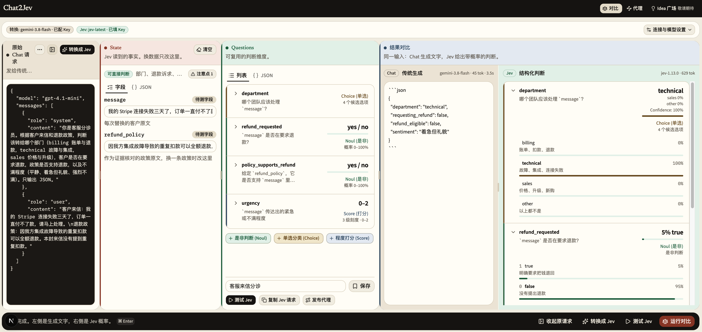

# Chat2Jev

[English](README.md) | 简体中文

把 OpenAI 兼容的 Chat Completions 请求转换成 TypeSafe System One（Jev）的 **State / Questions**，对照文字生成与结构化判断的结果，并把可复用的问题发布为代理路由。

当前界面以中文为主。

这是一个独立的实验项目，并非 OpenAI 或 TypeSafe 官方产品。适合本地使用或部署在受信任的网络内。

## 界面预览



在同一工作台中查看原始请求、编辑 State 和 Questions，并对比 Chat 与 Jev 的结果。图中以候选人求职意向判断为例，展示 Jev 的选项概率与评分。

## 能做什么

- **转换与对比**：粘贴 JSON、消息数组、文本或受支持的 cURL 请求，转换为 State / Questions，对比 Chat 和 Jev 的结果与耗时。
- **编辑与复用**：调整 State 和 Questions，在浏览器中保存问题包与工作草稿。
- **代理实验室**：按 slug、`jev:<slug>` 模型名或请求指纹匹配路由，输出 Chat Completions 形状的 JSON 或工具调用。
- **内置示例**：工单分流 `ticket-triage`、工具选择 `tool-router`。

Idea 广场目前是规划中的功能。代理只实现部分兼容能力，不支持流式返回，也不是完整的 OpenAI API 替代品。自由文本生成更适合传统 Chat 模型。

## 本地运行

需要 Node.js 22 和 npm。仓库包含 `.nvmrc`，使用 nvm 时可先运行 `nvm use`。

```bash
git clone https://github.com/Chandler-Sun/chat2jev.git
cd chat2jev
npm ci
npm run dev -- --hostname 127.0.0.1
```

打开 <http://localhost:3000>。在设置中填入 OpenAI 兼容服务地址、模型名及其 API Key，再填入 TypeSafe API Key。服务地址可以是基础地址、以 `/v1` 结尾的地址或完整的 `/chat/completions` 地址。无需认证的本地模型可留空转换模型 Key。

载入示例后，可以直接查看已有 State / Questions；点击转换或运行对比时才会调用模型。模型调用可能产生对应服务商的费用，需要自行准备可用凭据。本地启动和单元测试不需要 API Key。

## 数据与部署边界

**模型密钥在调用时会发送到本应用服务端，再转发到对应模型服务。**“记住密钥”默认开启，密钥以明文保存在当前站点的浏览器 `localStorage`。取消勾选可停止在设置中持久保存密钥；清除该站点数据可删除已保存的草稿、问题包和设置。

原始请求草稿也会保存在浏览器中，因此粘贴前请自行移除请求中的真实凭据与敏感内容。请求解析中的字段过滤不等同于完整脱敏。模型服务会收到转换或判断所需的内容，适用其自身的数据处理政策。

当前没有内置登录、权限隔离或限流；路由列表及读写接口共享同一份数据。Node.js 部署允许自定义上游地址，包括内网地址，因此不应直接向不受信任的用户开放。部署前请阅读 [安全说明](SECURITY.md)。

## 常用命令

| 命令 | 用途 |
| --- | --- |
| `npm run dev -- --hostname 127.0.0.1` | 本地开发 |
| `npm run lint` | ESLint 检查，警告也会失败 |
| `npm run typecheck` | TypeScript 类型检查 |
| `npm test` | 运行本地单元测试，不调用模型 |
| `npm run build` | 用 OpenNext 打出 Cloudflare Worker 包 |
| `npm run build:next` | 只做 Next.js 生产构建 |
| `npm run build:worker` | 与 `npm run build` 相同，留给旧的控制台配置 |
| `npm start -- --hostname 127.0.0.1` | 运行 Next.js 生产构建 |
| `npm run preview` | 构建并预览 Cloudflare Worker |
| `npm run deploy` | 构建并部署到当前 Cloudflare 账号 |

构建时 `next/font` 会从 Google Fonts 下载字体，需要网络连接。

## 代理调用

代理地址是 `/api/v1/chat/completions`。以下请求直接使用内置工单路由，需提供自己的 TypeSafe Key：

```bash
export TYPESAFE_API_KEY='replace-with-your-key'
curl http://localhost:3000/api/v1/chat/completions \
  -H 'Content-Type: application/json' \
  -H "x-typesafe-key: $TYPESAFE_API_KEY" \
  -H 'x-jev-mode: jev-only' \
  --data '{
    "model": "jev:ticket-triage",
    "messages": [{
      "role": "user",
      "content": "客户来信：连接失败三天了，希望退款。\n退款政策：集成故障可退。"
    }]
  }'
```

请求头、匹配顺序及兼容限制见 [代理 API](docs/proxy-api.md)。

## 部署到 Cloudflare Workers

项目通过 OpenNext 将 Next.js 构建为 Worker，API 使用 Node 兼容运行时。

```bash
cp .dev.vars.example .dev.vars
npx wrangler login
npm run preview
# 确认目标账号与访问控制后执行：
npm run deploy
```

Cloudflare Workers Builds 可以继续用 `npm run build`。它现在会跑 OpenNext 并生成 `.open-next/worker.js`，供 `npx wrangler deploy` 使用。只跑 `next build` 不够：Wrangler 接着会报 “Could not find compiled Open Next config”。

`wrangler.jsonc` 中的 Worker 名称可以修改。`.dev.vars` 只用于本地配置，不应提交真实凭据。

内置路由始终可用。自定义路由在普通 Node.js 运行时写入 `data/jev-routes.json`；Workers 未绑定 KV 时只保存在当前实例内存，实例重启或切换后可能丢失。需要持久化时：

```bash
npx wrangler kv namespace create JEV_ROUTES
```

将返回的命名空间 ID 加到 `wrangler.jsonc` 的顶层字段中：

```json
"kv_namespaces": [{ "binding": "JEV_ROUTES", "id": "YOUR_NAMESPACE_ID" }]
```

KV 中所有自定义路由共用一个键，当前没有跨实例写入协调，不适合多人并发管理。Node.js 部署请使用可写的持久目录，否则可能回退为内存存储。

## 项目结构

```text
src/app/          页面及 API 路由
src/components/  工作台、编辑器与 UI 组件
src/lib/         请求解析、转换、TypeSafe 客户端及测试
src/lib/proxy/   路由匹配、State 映射、存储和输出组装
src/tools/       工具导航注册表
```

基于 Next.js、React、TypeScript、Tailwind CSS、shadcn/ui 和 OpenNext 构建。

## 参与贡献

欢迎提交问题和改进，步骤见 [贡献指南](CONTRIBUTING.md)。发布前核对 [发布清单](docs/releasing.md)。修改通用操作说明或功能描述时，请同步更新中英文 README。

## 许可证

本项目采用 [MIT License](LICENSE)。第三方依赖保留各自的许可证；API 服务的使用仍受对应服务条款约束。
